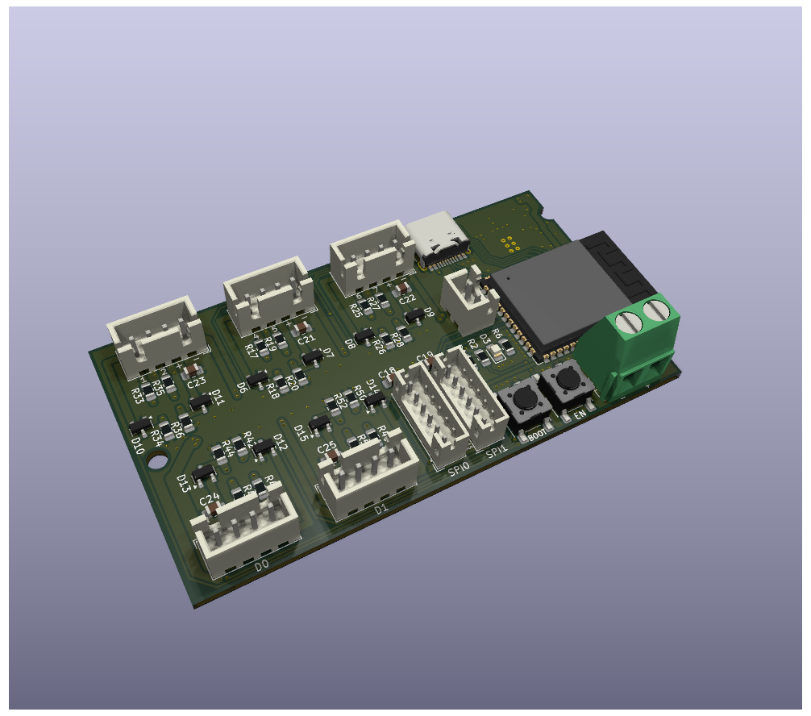
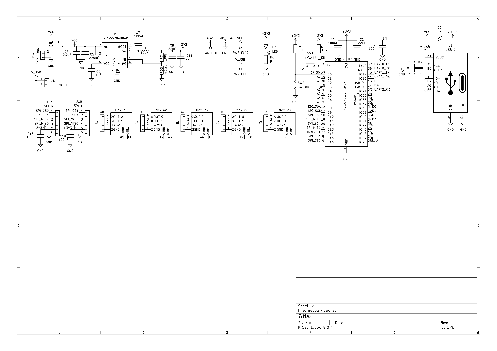
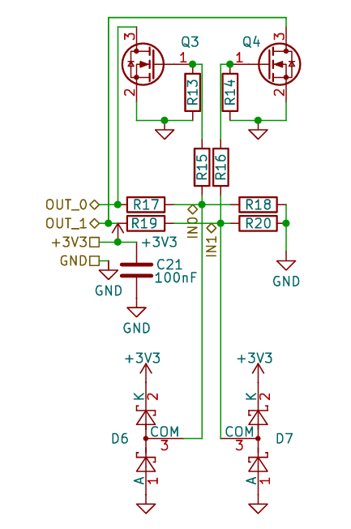

# ESP32-S3 IoT Carrier Board

A simple and versatile IO carrier board (PCB) designed to simplify the integration of IoT sensors and actuators with the ESP32S3.

## Main Features

* **5x JST 2.50mm Ports (4-pin):** Convenient connectors for easy peripheral attachment.
* **2x JST 2.50mm Ports (6-pin):** Dedicated bus connectors for I2C, SPI, or other multi-wire protocols.
* **Built-in 3.3V Regulator:** High-efficiency converter supporting up to **2A** of current.
* **Triple-Mode Pin Configuration:** Each control pin can be hardware-configured in three ways to suit your application:
    1. **Direct to ESP32:** For standard 3.3V logic and digital communication.
    2. **Voltage Divider:** Enables safe reading of higher-voltage analog or digital signals.
    3. **MOSFET Driver (Low-side switch):** For controlling high-current devices like LED strips, relays, or small motors.

## Pinout (JST 2.50mm)

All five 4-pin connectors share the same standardized pinout:

| Pin | Function | Description |
| :--- | :--- | :--- |
| **1** | `VCC (+)` | Power supply for the external device. |
| **2** | `GND (-)` | Common ground. |
| **3** | `SIG_1` | Control Pin 1 (Direct / Divider / MOSFET). |
| **4** | `SIG_2` | Control Pin 2 (Direct / Divider / MOSFET). |

  
  

## Repository Contents

This repository includes all necessary files for manufacturing and assembly:
* **Schematics:** Detailed circuit diagrams.
* **Gerber Files:** Production-ready files for PCB fabrication.
* **BOM (Bill of Materials):** A complete list of required components.
* **3D Model:** The board layout in `.step` format for enclosure design.****
